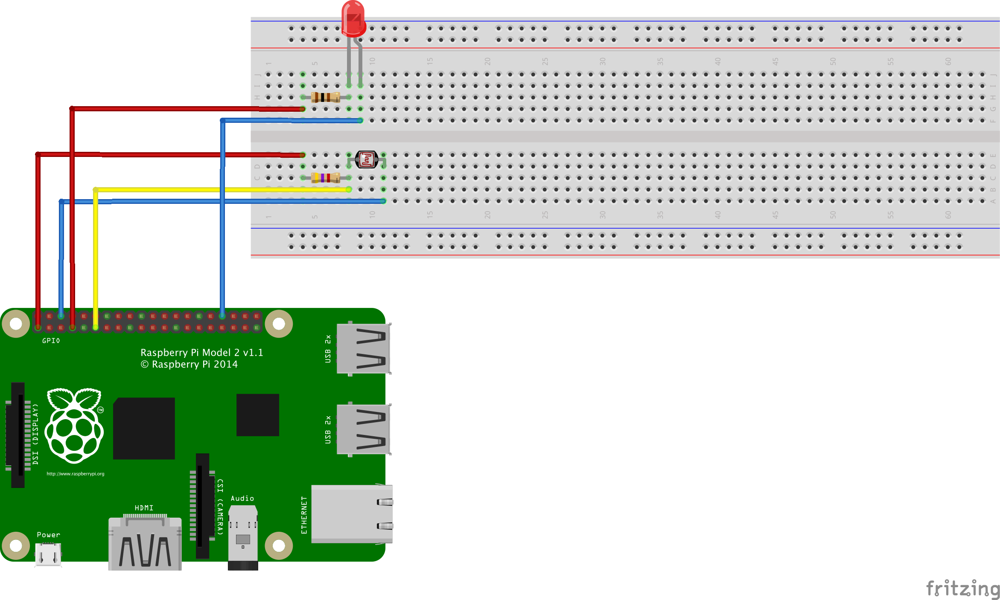

# Dokumentation zur Inbetriebnahme des Photolink Projekts

## Raspberry aufsetzen

Um den Raspberry Pi aufzusetzen sind folgende Schritte nötig:
* Filesystem entpacken
* User-Password anpassen
* Sprache auf `de_DE.UTF-8` setzen
* Zeitzone auf Europe -> Berlin setzen
* Keyboard-Layout auf `Deutsch` setzen
* SSH aktivieren (im Bereich `Advanced`)

### WLAN

Für das WLAN muss die Datei `/etc/wpa_supplicant/wpa_supplicant.conf`angepasst werden:

    ctrl_interface=DIR=/var/run/wpa_supplicant GROUP=netdev
    update_config=1
    network={
    	ssid="UzL-Konferenz-WPA"
    	key_mgmt=WPA-EAP
    	eap=TTLS
    	identity="USER"
    	password="PASS"
    	ca_cert="/etc/wpa_supplicant/telekom.crt"
    	phase2="auth=MSCHAPV2"
    }

### hostname

Der Hostname soll auf `pi-08`gesetzt werden.

## Abhängigkeiten installieren

Zum Ausführen des Projekts müssen folgende Abhängigkeiten auf dem Raspberry installiert werden:

### wiringpi

[WiringPi](http://wiringpi.com) wird mit `git clone git://git.drogon.net/wiringPi` heruntergeladen
und mit `./build` im heruntergeladenen Vezeichnis global installiert.

### pi4j

[Pi4j](http://pi4j.com) wird auf dem Raspberry mit `curl -s get.pi4j.com | sudo bash` installiert.
Für die Entwicklung ist es zusätzlich auch im maven build process integriert und wird mit `mvn compile` heruntergeladen.

### Maven

Maven steht als alternative zum kompilieren und ausführen zur Verfügung.
Maven wird über `apt-get install mvn` installiert.
Hierbei kann unter umständen eine veraltete Java-version mitinstalliert werden.
Damit dies später keine Probleme bereitet muss zusätzlich per `sudo update-alternatives --config java`
die richtige Java version (1.8) ausgewählt werden.

## Programm

### Ausführen des Programms

Zunächst muss das Repository auf den Raspberry heruntergeladen werden.

    git clone https://github.com/hauptbenutzer/pi-projekt-it.git

Anschließend wechselt man in das Wurzelverzeichnis des Projekts.

    cd pi-projekt-it/pi-photoblink/

Als Build-System wird Maven eingesetzt. Um es zu kompilieren kann das `compile`
target von Maven verwendet werden.

    mvn compile

Das Programm lässt sich schließlich per Aufruf des
[Exec Maven Plugin](http://mojo.codehaus.org/exec-maven-plugin/) ausführen.

    mvn exec:java

### Projekt Aufbau

Im Maven
[Buildfile](https://github.com/hauptbenutzer/pi-projekt-it/blob/master/pi-photoblink/pom.xml)
ist das Projekt sinnvoll vorkonfiguriert.

pom.xml

    [...]
    <dependency>
      <groupId>com.pi4j</groupId>
      <artifactId>pi4j-core</artifactId>
      <version>1.0</version>
    </dependency>
    [...]

Dies ist die Abhängigkeit zu [Pi4J](http://pi4j.com/), welches eine Library ist,
die einen einfachen Zugriff auf die Ein- und Ausgabe-Pins des Raspberry
ermöglicht.

pom.xml

    [...]
    <plugin>
      <groupId>org.apache.maven.plugins</groupId>
      <artifactId>maven-compiler-plugin</artifactId>
      <version>3.3</version>
      <configuration>
        <source>1.8</source>
        <target>1.8</target>
      </configuration>
    </plugin>
    [...]

Durch Konfiguration des Maven Compiler Plugins wird sichergestellt, dass Java 8
zum Kompilieren benutzt wird.

Der eigentliche Programmcode befindet sich in der Datei
[ListenGpioExample.java](https://github.com/hauptbenutzer/pi-projekt-it/blob/master/pi-photoblink/src/main/java/de/uni_luebeck/itm/sva08/ListenGpioExample.java).

ListenGpioExample.java

    [...]
    final GpioPinDigitalInput sensor = gpio.provisionDigitalInputPin(RaspiPin.GPIO_00);
    final GpioPinDigitalOutput led = gpio.provisionDigitalOutputPin(RaspiPin.GPIO_07);
    [...]

An dieser Stelle werden die Pins des Lichtsensors und der LED als Ein- bzw.
Ausgabe-Pin initialisiert. Die Objekte können anschließend zum Lesen bzw.
Schreiben verwendet werden.

    [...]
    sensor.addTrigger(new GpioSyncStateTrigger(led));
    [...]

In dieser Zeile steckt die eigentliche Programmlogik. Ein Trigger kann genutzt
werden um eine Aktion bei einer Statusänderung auszulösen. In diesem Fall wird
ein `GpioSyncStateTrigger` genutzt, der den als Parameter übergebenen
Ausgabe-Pin auf den Zustand des beobachteten Pins setzt.

Bei der beschriebenen Schaltung liefert der Lichtsensor eine 0, wenn er nicht
verdeckt ist und eine 1, wenn kein Licht auf ihn fällt. Durch die
Synchronisierung der LED mit dem Lichtsensor ergibt sich als Verhalten demnach,
dass die LED leuchtet, wenn der Sensor verdeckt ist.

### Berechnung der Widerstände

#### LED

Die LED hat eine Betriebsspannung von 2 bis 2,5 Volt und benötigt 25mA Stromstärke.
Der Raspberry gibt für eine logische 0 0V aus und für eine logische 1 3,3V.
Über den Widerstand muss eine Spannung von Urv anliegen.

    Urv=Uges - Ud = 3,3V - (2.0 ... 2,5)V = (0,8 ... 1,3)V

Hieraus ergibt sich der nötige Widerstand Rv wie folgt:

    Rv=Urv/Irv = (0,8...1,3)V/25mA=(32...52) Ohm

Der nächstmögliche vorhandene Widerstand hat 100 Ohm und wird eingesetzt.

#### Photosensor

Der Raspberry liest an einem Input ab 2V eine logische 1, unter 0,8V eine logische 0.

## Raspberry anschließen 

